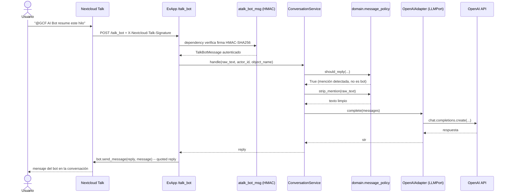
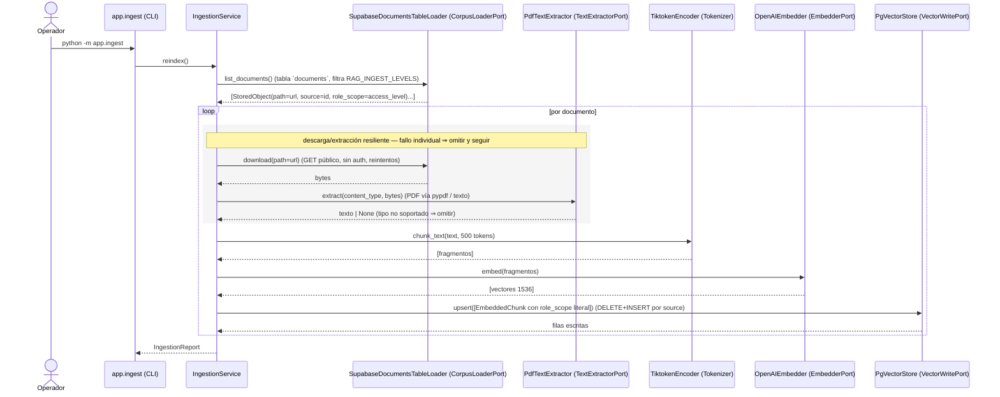
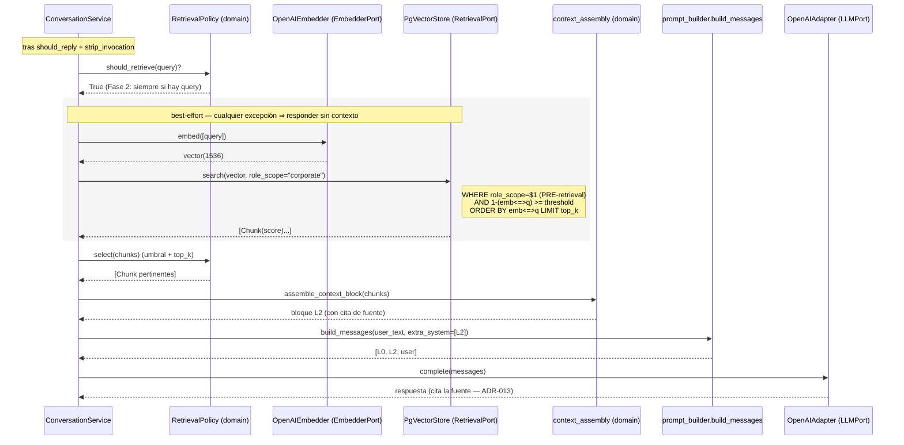

# Arquitectura — GCF Talk AI Bot

Documento de referencia técnica de la Fase 1. Describe los principios,
las capas, los flujos y las decisiones de diseño tomadas durante la
implementación, así como la deuda técnica y la propuesta de Fase 2.

## 1. Principios rectores

- **KISS** — el bot resuelve un único caso de uso (responder a una
  @mención con la salida de un LLM). No hay capas que no sirvan a
  esa ruta crítica.
- **SRP** — cada módulo tiene una responsabilidad: política de trigger,
  construcción de prompt, llamada al LLM, transporte HTTP.
- **Hexagonal (Ports & Adapters)** — el dominio no conoce ni a Talk ni
  a OpenAI. Los proveedores externos entran por puertos (`LLMPort`).
- **DRY** — la lógica de trigger y *strip* de la mención vive en un
  único módulo (`domain/message_policy.py`), consumido por el servicio
  y por los tests sin duplicación.
- **YAGNI** — no se introduce persistencia, cache ni cola de mensajes
  hasta que un caso de uso lo justifique. Talk ya conserva el historial.
- **12-factor** — configuración exclusivamente por entorno (`.env` en
  desarrollo, inyección de AppAPI en producción). Sin estado local en
  disco salvo el volumen reservado por `nc_py_api`.
- **Defense in depth** — autenticación en dos niveles: middleware de
  AppAPI (shared secret) y verificación HMAC-SHA256 del webhook de
  Talk (`atalk_bot_msg`). Cada nivel rechaza por su cuenta.

## 2. Patrón arquitectónico

Tres patrones se superponen:

1. **Hexagonal**: el núcleo de dominio es puro Python sin dependencias
   de framework. Los adaptadores (OpenAI, Talk) se intercambian sin
   tocar el dominio.
2. **ExApp pattern (AppAPI)**: la aplicación implementa los
   *lifecycle endpoints* (`/init`, `/enabled`, `/heartbeat`) que AppAPI
   invoca, y se registra como bot de Talk vía `register_talk_bot`.
3. **Event-driven webhook**: la entrada al sistema es un POST de Talk
   sobre `/talk_bot`; no hay *polling* ni colas. Cada evento se
   procesa de forma independiente y *stateless*.

## 3. Mapa de capas

```
┌────────────────────────────────────────────────────────────┐
│  handlers/   (transport — FastAPI, nc_py_api)              │
│  ├─ Recibe TalkBotMessage ya autenticado                   │
│  └─ Llama al servicio, devuelve la respuesta al bot        │
├────────────────────────────────────────────────────────────┤
│  services/   (use cases + ports)                           │
│  ├─ ConversationService: trigger → [RAG] → prompt → LLM    │
│  ├─ IngestionService: loader → chunk → embed → upsert      │
│  ├─ LLMPort / EmbedderPort: contratos de proveedores       │
│  ├─ RetrievalPort / VectorWritePort: contratos del store   │
│  ├─ CorpusLoaderPort: contrato del corpus físico           │
│  └─ ConversationMemoryPort: buffer de memoria por sala     │
├────────────────────────────────────────────────────────────┤
│  adapters/   (infra — clientes externos)                   │
│  ├─ OpenAIAdapter: implementa LLMPort                      │
│  ├─ OpenAIEmbedder: implementa EmbedderPort                │
│  ├─ PgVectorStore: implementa RetrievalPort+VectorWritePort│
│  ├─ SupabaseDocumentsTableLoader: implementa CorpusLoaderPort│
│  ├─ PdfTextExtractor: implementa TextExtractorPort (pypdf) │
│  ├─ TiktokenEncoder: implementa domain.chunking.Tokenizer  │
│  └─ InMemoryConversationMemory: implementa ConversationMemoryPort│
├────────────────────────────────────────────────────────────┤
│  domain/     (lógica pura, sin I/O)                        │
│  ├─ Message (dataclass)                                    │
│  ├─ Chunk / EmbeddedChunk (dataclasses RAG)                │
│  ├─ message_policy: should_reply / strip_mention           │
│  ├─ chunking: chunk_text (Tokenizer inyectable)            │
│  ├─ retrieval_policy: should_retrieve / select             │
│  ├─ context_assembly: assemble_context_block (L2)          │
│  └─ prompt_builder: build_messages (L0 + L2 + history)     │
└────────────────────────────────────────────────────────────┘
```

Reglas de importación entre capas:

| Capa       | Puede importar de                  | NO puede importar de                    |
|------------|------------------------------------|-----------------------------------------|
| `domain`   | stdlib                             | `services`, `adapters`, `handlers`, FastAPI, `nc_py_api`, `openai` |
| `services` | `domain`, stdlib                   | `handlers`, FastAPI, `nc_py_api`        |
| `adapters` | `domain`, `services` (sólo puertos), SDKs externos | `handlers`              |
| `handlers` | `services`, `nc_py_api`, FastAPI   | `adapters` directamente, `openai`       |

El `main.py` es el *composition root* de la ruta de petición: instancia los
adapters (LLM y, si hay config, embedder + vector store), los inyecta en el
servicio y registra el handler. `app/ingest.py` es el *composition root* de la
ingestión (CLI). Son los únicos puntos donde se referencian todas las capas.

**Reconciliación tiktoken ↔ regla de capas.** ADR-009 fija el chunking con
`tiktoken`, pero `domain/` está limitado a la stdlib. Para no violar la regla,
`domain/chunking.chunk_text` es puro y recibe un `Tokenizer` (Protocol) por
inyección; el tokenizador real respaldado por `tiktoken` (encoding
`cl100k_base`) vive en `adapters/tiktoken_encoder.py`. Beneficio colateral:
los tests de chunking corren sin red (tiktoken descarga su vocabulario en el
primer uso), inyectando un tokenizador determinista.

## 4. Flujo de un mensaje



## 5. Decisiones de diseño (ADRs)

### ADR-001 — AppAPI `manual-install` en lugar de `docker-install`

| | |
|--|--|
| **Problema** | AppAPI ofrece dos modos de despliegue: `docker-install` (AppAPI controla el ciclo de vida del contenedor) y `manual-install` (el operador despliega; AppAPI sólo lo descubre y consume). |
| **Decisión** | Adoptar `manual-install`. |
| **Consecuencias** | El operador es responsable de `docker compose up`/`down`. A cambio, AppAPI no requiere acceso al *Docker socket*, reduciendo la superficie de ataque del proceso PHP de Nextcloud. |
| **Alternativas descartadas** | `docker-install` exigía montar `/var/run/docker.sock` en el contenedor de Nextcloud; se rechazó por política de seguridad. |

### ADR-002 — `LLMPort` + Adapter (Hexagonal) en lugar de usar el SDK de OpenAI directamente

| | |
|--|--|
| **Problema** | El servicio de conversación necesita invocar un LLM. Acoplarlo al SDK de OpenAI haría imposible probarlo sin red y dificultaría cambiar de proveedor. |
| **Decisión** | Definir un `Protocol` `LLMPort` en `services/` y mantener el SDK detrás de `adapters/openai_adapter.py`. |
| **Consecuencias** | El servicio se prueba con dobles triviales. Cambiar a Azure OpenAI, Anthropic o un modelo on-premise es escribir un nuevo adapter, sin tocar el dominio. |
| **Alternativas descartadas** | Uso directo de `openai.AsyncOpenAI` desde el servicio: más corto, pero acopla la lógica de negocio al SDK y al schema de errores del proveedor. |

### ADR-003 — Stateless, sin base de datos propia

| | |
|--|--|
| **Problema** | Un asistente conversacional necesita contexto. ¿Lo persiste la ExApp o lo recupera del sistema? |
| **Decisión** | No introducir BD ni cache propios en Fase 1. |
| **Consecuencias** | El bot escala horizontalmente sin coordinación. El historial vive en Talk, que ya es la fuente de verdad. La operación es más simple (un único contenedor sin dependencias). |
| **Alternativas descartadas** | Cache local de conversaciones (Redis, SQLite): YAGNI mientras los prompts encajen en el contexto de un único mensaje + historial recuperable bajo demanda. |
| **Enmienda Fase 2** | La Fase 2 introduce **pgvector** como dependencia *stateful* (ADR-007). El trade-off se asume de forma acotada: (1) el estado es **compartido y de solo-lectura** en la ruta de petición — el bot solo hace `SELECT`, no muta nada por request, así que el escalado horizontal del bot se conserva; (2) **no hay estado por usuario ni global mutable en el proceso** — cada búsqueda abre y cierra su conexión (sin estado entre peticiones); (3) la escritura está **fuera de la ruta crítica**, en la CLI de ingestión (ADR-010). El historial conversacional sigue viviendo en Talk: pgvector almacena el *corpus*, no las conversaciones. La afirmación "sin BD propia" de la Fase 1 queda matizada, no contradicha: el bot pasa de *stateless puro* a *stateless de cómputo con una dependencia stateful externa de solo-lectura*. |
| **Enmienda ADR-014 (memoria conversacional)** | El enunciado original "el bot recupera el contexto del sistema" se corrige por precisión: el bot es **push-only** y **NO lee el historial** de Talk (no puede — la API OCS de chat no está disponible para la ExApp; ver ADR-014). La memoria conversacional se implementa como un **buffer in-memory efímero por sala** que registra los mensajes que Talk ya *empuja* por webhook y los reproduce como turnos previos. Esto introduce **estado mutable en el proceso** (a diferencia de la enmienda de pgvector, que es solo-lectura y sin estado por proceso): el bot deja de ser *stateless puro* también por este flanco. No contradice "sin BD propia" — el buffer vive en RAM, no hay persistencia ni dependencia externa nueva — pero **fuerza el constraint de 1 worker** (deuda **D7**): el estado no se comparte entre réplicas. Multi-réplica exigiría un store compartido (Opción C de ADR-014). |

### ADR-004 — Trigger por @mención exclusiva, no por todo mensaje

| | |
|--|--|
| **Problema** | Un bot que responde a todo dispara coste de LLM en cada turno y resulta intrusivo en salas grupales. |
| **Decisión** | Responder únicamente cuando el `display_name` aparece como `@mention` en el texto. |
| **Consecuencias** | Coste de OpenAI proporcional a la demanda real. UX no intrusiva: el bot es invocado, no impuesto. |
| **Alternativas descartadas** | Responder a todo: rechazado por coste y UX. Prefijo de comando (`/ai`): rechazado por inconsistencia con la convención de menciones de Talk. |

### ADR-005 — `nc_py_api[app]` en lugar de cliente HTTP propio

| | |
|--|--|
| **Problema** | La integración con AppAPI requiere lifecycle endpoints, autenticación por shared secret, registro vía OCS y verificación HMAC del webhook de Talk. |
| **Decisión** | Apoyarse en `nc_py_api[app]` (pinneado a `>=0.30,<0.31`). |
| **Consecuencias** | Se obtienen *gratis* el middleware de auth, `set_handlers`, `atalk_bot_msg`, `register_talk_bot` y el cliente OCS. Coste: queda como dependencia crítica; cambios mayores entre minor versions exigen revisión (ver Troubleshooting #3 del README). |
| **Alternativas descartadas** | Cliente HTTP propio (httpx + firma manual): viable pero reimplementa código bien probado y exige mantener compatibilidad con cada cambio de AppAPI. |

### ADR-006 — Nextcloud Files como corpus: **NO-GO** (spike cerrado)

| | |
|--|--|
| **Problema** | ¿Puede Nextcloud Files ser la *fuente de verdad* del corpus RAG, leído vía `nc_py_api`? |
| **Decisión** | **NO-GO.** Ver `docs/spikes/SPIKE_NEXTCLOUD_FILES.md` y el commit de cierre. El spike validó capacidades (listado, descarga en streaming, tags, shares), pero el modelo de identidad/permisos y la ausencia de un API de cambios incremental hacían frágil y costosa la ingestión. |
| **Consecuencias** | Se pivota a Supabase Storage como corpus físico (ADR-006-bis). El código del spike queda como referencia y debe retirarse antes del merge final (marcado `SPIKE — REMOVE BEFORE MERGE`). |

### ADR-006-bis — Corpus físico en Supabase Storage, READ-ONLY

| | |
|--|--|
| **Problema** | Tras el NO-GO de ADR-006, ¿dónde viven los documentos a indexar? |
| **Decisión** | Supabase Storage como corpus físico, consumido en **solo-lectura** vía REST con `httpx` (no el SDK oficial, para no arrastrar sus dependencias pesadas). |
| **Consecuencias** | El loader (`SupabaseStorageLoader`) lista y descarga objetos; nunca escribe. Se exige **credencial de mínimo privilegio** (clave read-only del bucket), nunca la *service-role key* que salta RLS. |
| **Alternativas descartadas** | SDK `supabase` (deps pesadas + pins propios). Nextcloud Files (ADR-006, NO-GO). |

### ADR-006-ter — Corpus descrito en tabla-catálogo + descarga pública cross-proyecto

| | |
|--|--|
| **Problema** | El bucket de ADR-006-bis quedó **obsoleto**: el corpus real no es una lista de objetos de un bucket accesible, sino que está **descrito en una tabla-catálogo** `documents` (Supabase PostgREST). Cada fila apunta (columna `url`) al PDF público alojado en **otro** proyecto Supabase. |
| **Decisión** | Nuevo adapter `SupabaseDocumentsTableLoader` (implementa `CorpusLoaderPort`, READ-ONLY): (1) lee `GET /rest/v1/documents?select=*` con la anon key, paginado; (2) filtra por `access_level` según `RAG_INGEST_LEVELS` (default `noroot`); (3) descarga `row["url"]` **sin** headers de auth (es público y de otro proyecto), con timeout y reintentos (3) con backoff ante timeouts. `path`=url (locator), `source`=`str(id)` (cita estable, ADR-013), `role_scope`=`access_level` **literal** (noroot/root/semiroot, no se aplana). |
| **Consecuencias** | **Acoplamiento a 2 proyectos Supabase** (catálogo + almacén de archivos), registrado como deuda D6. La extracción de texto se externaliza a `TextExtractorPort` (pypdf) porque `services/` no puede importar SDKs (§3). Se añade **resiliencia por documento** en `IngestionService`: un fallo de descarga/extracción individual se omite y se cuenta, sin abortar el lote (corrige el bug de producción donde un único documento tumbaba toda la ingestión). `SupabaseStorageLoader` y `SUPABASE_BUCKET` quedan **deprecados** (se conservan sin consumirse). |
| **Alternativas descartadas** | Mantener el bucket (ADR-006-bis): la fuente real no está allí. Loader con estado oculto (mapa name→url): se descartó por el invariante implícito; se prefirió extender `StoredObject` con `source`/`role_scope` opcionales (explícito, sin estado oculto). Extracción de PDF dentro del servicio: viola la regla de capas (§3). |

### ADR-007 — Vector store = pgvector en Postgres dedicado

| | |
|--|--|
| **Problema** | ¿Dónde se almacenan y buscan los embeddings? |
| **Decisión** | `pgvector` sobre un Postgres **dedicado**, externo al Postgres de Chat IA. Imagen `pgvector/pgvector:pg16`, en `vps2DockerNet`, sin publicar puertos al host. |
| **Consecuencias** | Introduce una dependencia *stateful* (ver enmienda a ADR-003). Aislamiento del store de Chat IA: blast radius y tuning independientes. |
| **Alternativas descartadas** | Reusar el Postgres de Chat IA (acoplamiento, riesgo cruzado). Vector store gestionado externo (coste/latencia/governanza de datos). |

### ADR-008 — Embeddings con text-embedding-3-small (dim 1536)

| | |
|--|--|
| **Decisión** | `text-embedding-3-small` (1536 dim) vía `OpenAIEmbedder` (implementa `EmbedderPort`). |
| **Consecuencias** | La columna `embedding` es `vector(1536)`. Cambiar de modelo exige reindexar y, si cambia la dimensión, migrar el esquema. |

### ADR-009 — Chunking fijo de 500 tokens (tiktoken cl100k_base)

| | |
|--|--|
| **Problema** | El antipatrón "1 vector = 1 documento" degrada el recall. |
| **Decisión** | Chunking fijo de 500 tokens con `tiktoken` (encoding `cl100k_base`). |
| **Consecuencias** | `chunk_text` vive en `domain/` y es puro: recibe un `Tokenizer` inyectable; el encoder real (tiktoken) es un adapter (ver reconciliación en §3). Tests sin red. |
| **Alternativas descartadas** | Chunk por documento (antipatrón). Chunk por frase/semántico: mayor complejidad; YAGNI hasta tener métricas de recall. |

### ADR-010 — Ingestión on-demand vía CLI, no endpoint HTTP

| | |
|--|--|
| **Decisión** | La reindexación se dispara con `python -m app.ingest`, no por un endpoint HTTP. |
| **Consecuencias** | La escritura queda fuera de la ruta de petición (refuerza ADR-003). Menor superficie de ataque (no hay endpoint de escritura expuesto). El operador controla cuándo reindexar. |
| **Alternativas descartadas** | Endpoint `/reindex`: superficie de ataque + necesidad de auth/rate-limit propios; webhook de cambios de Storage: YAGNI en esta fase. |

### ADR-011 — Scoping por rol como filtro PRE-retrieval

| | |
|--|--|
| **Problema** | Evitar el antipatrón "ACL post-retrieval", que filtra después de recuperar y puede filtrar datos por canales laterales (scores, conteos). |
| **Decisión** | `role_scope` es **metadata** de cada chunk y se aplica como `WHERE role_scope = $1` **antes/junto** a la búsqueda vectorial (índice btree sobre `role_scope`). |
| **Consecuencias** | `RetrievalPort.search(query_embedding, role_scope)` exige el scope. En esta fase el scope es **fijo** (`corporate`). **PENDIENTE:** mapear el actor de Talk → grupo/rol real de Nextcloud para derivar el scope por usuario. |

### ADR-012 — Umbral de similitud + top_k configurables

| | |
|--|--|
| **Problema** | El antipatrón "sin umbral" inyecta ruido irrelevante en el prompt. |
| **Decisión** | `RAG_SIMILARITY_THRESHOLD` (default 0.75) y `RAG_TOP_K` (default 4), centralizados en `RetrievalPolicy`. La búsqueda usa distancia coseno; la similitud es `1 - (embedding <=> q)` ∈ [0, 1]. |
| **Consecuencias** | El store aplica umbral y `LIMIT` en SQL; `RetrievalPolicy.select` reaplica la misma regla en el dominio (defensa en profundidad + testeable sin BD). |

### ADR-013 — La respuesta cita la fuente

| | |
|--|--|
| **Decisión** | El bloque L2 (`context_assembly`) rotula cada fragmento con su `source` e instruye al modelo a citar la fuente (p. ej. "Según `politicas-rrhh.pdf`…"). |
| **Consecuencias** | `Chunk.source` es legible (nombre de objeto). La instrucción L2 es **subordinada a L0**: no puede sobrescribir las reglas inviolables; si el contexto no es pertinente, el modelo debe ignorarlo y no inventar. |

### ADR-014 — Memoria conversacional como buffer in-memory por sala (Opción B)

| | |
|--|--|
| **Problema** | El bot respondía a una @mención usando SOLO el mensaje que la disparó; no tenía memoria de los turnos previos de la sala. Una pregunta de seguimiento ("dame un ejemplo") perdía el contexto. ¿Cómo dar memoria conversacional sin romper el modelo *stateless* ni añadir infraestructura? |
| **Decisión** | **Opción B**: un **buffer in-memory por sala** (`token -> deque`), acotado y efímero. El bot ya recibe por webhook TODOS los mensajes de las salas donde está instalado; basta con registrarlos y reproducirlos como turnos previos (`history`) al construir el prompt. Sin dependencias externas nuevas (NADA de Redis/BD), sin persistencia. Puerto `ConversationMemoryPort` + adapter `InMemoryConversationMemory`; `build_messages` se extiende con un parámetro **aditivo** `history` (OCP: la firma previa no se rompe). L0 permanece inmutable y siempre primero; el anti-loop (`should_reply` + filtro `actor_id` `bots/`) no se toca. |
| **Consecuencias** | El bot gana memoria de corto plazo por sala con coste ~cero de infraestructura. **Trade-offs**: (1) el buffer vive en RAM y se pierde al reiniciar (aceptado); (2) introduce estado mutable en el proceso ⇒ **constraint de 1 worker** (deuda **D7**), pues el buffer no se comparte entre réplicas; (3) acotado por `max_messages` (eviction FIFO) y `ttl_seconds` (expiración por entrada) para no crecer sin límite. **Degradación elegante**: con `CONVERSATION_MEMORY_ENABLED=false` (o `memory=None`) el comportamiento es idéntico al de la Fase 1 (sin historia), igual que la opcionalidad de las deps de RAG. El registro captura TODO mensaje humano (no solo menciones), así las salas acumulan contexto aunque el bot calle; el eco de las propias respuestas del bot (`actor_id` `bots/`) NO se registra en entrada — el turno `assistant` se registra explícitamente en el camino de salida, evitando el doble conteo. El *fallback* de `LLMError` no se registra (no es contenido conversacional). |
| **Alternativas descartadas** | **Opción A — solo `inReplyTo`**: reconstruir la cadena de respuestas citadas del payload de Talk. Descartada: solo cubre hilos de *quoted replies* explícitas, no la conversación lineal natural; UX frágil (obliga a citar siempre). **Opción C — service account / HaRP**: que el bot lea el historial real vía la API OCS de chat con una cuenta de servicio (o el proxy HaRP de AppAPI). Descartada por **alcance y seguridad**: exige credenciales con permiso de lectura de chats (superficie y gobernanza de datos mayores), acopla a una API que la ExApp hoy no consume, y excede el alcance de esta iteración. Queda como la vía natural si se necesita memoria persistente o multi-réplica en el futuro. |

## 6. Failure modes y mitigaciones

| Escenario                                  | Mitigación                                                                                          |
|--------------------------------------------|-----------------------------------------------------------------------------------------------------|
| Timeout contra OpenAI                      | `OpenAIAdapter` levanta `LLMError`; `ConversationService` responde con mensaje de *fallback* en español al usuario y registra la excepción. |
| Error de la API de OpenAI (4xx/5xx)        | Mismo *fallback*; se loguea la excepción con `logger.exception` para diagnóstico.                   |
| Firma HMAC inválida en el webhook          | `atalk_bot_msg` rechaza la petición con HTTP 401 antes de ejecutar el handler. El evento se descarta. |
| Mensaje proveniente de otro bot            | `should_reply` filtra `actor_id` que empieza con `bots/` para evitar bucles entre bots.             |
| Mensaje sin mención al bot                 | `should_reply` devuelve `False`; no se llama al LLM, no hay coste.                                  |
| Evento de Talk que no es `message`         | `should_reply` filtra por `object_name == "message"`; se descartan reacciones, joins, etc.           |
| `OPENAI_API_KEY` ausente al arrancar       | El adapter tolera la key vacía en construcción y sólo falla en la primera invocación a `complete()`, permitiendo arrancar en CI sin secretos. |
| Fallo de recuperación RAG (pgvector caído, timeout del embedder) | La recuperación es **aditiva y best-effort**: `ConversationService._retrieve_context` captura la excepción, la loguea y responde **sin contexto** en lugar de tumbar la respuesta. El usuario recibe respuesta (genérica), no un fallback de error. |
| Config RAG incompleta al arrancar          | Si falta `PGVECTOR_DSN`/`OPENAI_API_KEY`, `settings.rag_enabled` es `False`: el bot no cablea RAG y degrada al comportamiento de la Fase 1 (responde sin contexto). El import de los adapters de RAG es perezoso, así que arranca sin esas dependencias. |
| Fragmentos por debajo del umbral           | `RetrievalPolicy.select` descarta lo que no supera `RAG_SIMILARITY_THRESHOLD`; si no queda nada, no se inyecta bloque L2 (evita ruido). |

## 7. Deuda técnica registrada

| ID  | Descripción                                                                              | Impacto                                  | Resolución propuesta              |
|-----|------------------------------------------------------------------------------------------|------------------------------------------|-----------------------------------|
| D1  | Detección de mención por regex sobre el texto plano del mensaje.                         | Frágil ante alias, formato HTML, escapes.| Migrar a `messageParameters` estructurado (ver Fase 2). |
| D2  | Sin observabilidad: sólo `logging.INFO`, sin métricas ni dashboards.                     | Difícil dimensionar coste y latencia.    | Exponer Prometheus metrics + dashboard Grafana. |
| D3  | Sin rate limiting por usuario o conversación.                                            | Riesgo de coste si un usuario abusa.     | Limitador en `ConversationService`. |
| D4  | ~~Sin RAG: el LLM responde sin contexto corporativo.~~ **Resuelto (parcial) en Fase 2:** pipeline RAG sobre tabla-catálogo + pgvector (ADR-006-bis…013, fuente vigente ADR-006-ter). Extractor de **PDF** resuelto (pypdf vía `TextExtractorPort`); `role_scope` ahora es **por-documento** (deriva del `access_level` literal). **PENDIENTE:** extractor de **DOCX**; mapear el actor de Talk → rol para derivar el scope de la *query* en la ruta de petición (ADR-011, hoy fijo `corporate` al recuperar). | — | — |
| D5  | Acoplado a OpenAI como único proveedor implementado (aunque el puerto está abstraído).    | Bloqueo si Compliance exige on-prem.     | Adapter alternativo (Azure / Anthropic / on-prem). |
| D6  | Ingestión acoplada a **2 proyectos Supabase** (ADR-006-ter): el catálogo (`documents`, anon key) y el almacén de archivos públicos (otro dominio, descarga sin auth). | Si cualquiera de los dos proyectos cambia de dominio, esquema o política de acceso, la ingestión se rompe. La descarga pública sin auth no es controlable por nosotros. | Unificar el corpus en una sola fuente gobernada, o mover los archivos a un almacén propio y guardar solo claves relativas en el catálogo. |
| D7  | Memoria conversacional **efímera en RAM** y **no compartida entre workers** (ADR-014): el buffer in-memory por sala vive en el proceso, se pierde al reiniciar y **fuerza el despliegue a 1 worker** (cada worker tendría su propio buffer, fragmentando el contexto de una misma sala). | Sin persistencia entre reinicios; imposible escalar a múltiples réplicas/workers sin fragmentar el contexto. El TTL/`max_messages` acotan la ventana de memoria. | Si se requiere memoria persistente o multi-réplica: store compartido (Redis) o leer el historial real (Opción C de ADR-014: service account / HaRP sobre la API OCS de chat). |

## 8. Roadmap Fase 2

- **RAG corporativo** — indexar documentos servidos por Nextcloud Files
  en un *vector store* y recuperar fragmentos relevantes antes de
  construir el prompt.
- **Tool calling** — exponer funciones de Nextcloud (calendario, tareas,
  búsqueda interna) como *tools* del modelo para resolver acciones,
  no sólo texto.
- **Observabilidad** — instrumentar la ExApp con Prometheus metrics
  (latencia LLM, tasa de fallbacks, tokens consumidos) y publicar
  un dashboard de Grafana de referencia.
- **Rate limiting** — aplicar cuotas por usuario y por conversación,
  con cabeceras informativas al usuario cuando se alcanza el límite.
- **Trigger sobre `messageParameters` estructurado** — sustituir el
  regex de mención por la detección estructurada que Talk ya entrega
  en el payload, eliminando D1.
- **Migración a Azure OpenAI** — si Compliance lo exige, escribir un
  `AzureOpenAIAdapter` que implemente `LLMPort` sin tocar el dominio.

## 9. Fase 2 — Pipeline RAG

La Fase 2 alimenta el slot **L2** del Layered System Prompt con contexto
corporativo recuperado por similitud, sin tocar L0 ni la firma de
`build_messages` (el contexto entra por `extra_system`, aditivo).

### 9.1 Ruta de ingestión (CLI, on-demand — ADR-010)



### 9.2 Ruta de petición (recuperación + L2)



### 9.3 Puertos nuevos

| Puerto              | Ubicación                          | Implementación              | Consumidores            |
|---------------------|------------------------------------|-----------------------------|-------------------------|
| `EmbedderPort`      | `services/embedder_port.py`        | `OpenAIEmbedder`            | Conversation, Ingestion |
| `RetrievalPort`     | `services/retrieval_port.py`       | `PgVectorStore`             | ConversationService     |
| `VectorWritePort`   | `services/retrieval_port.py`       | `PgVectorStore`             | IngestionService        |
| `CorpusLoaderPort`  | `services/corpus_loader_port.py`   | `SupabaseDocumentsTableLoader` (ADR-006-ter; `SupabaseStorageLoader` deprecado) | IngestionService |
| `TextExtractorPort` | `services/text_extractor_port.py`  | `PdfTextExtractor` (pypdf + texto) | IngestionService |
| `Tokenizer`         | `domain/chunking.py`               | `TiktokenEncoder` (adapter) | chunk_text / Ingestion  |
| `ConversationMemoryPort` | `services/conversation_memory_port.py` | `InMemoryConversationMemory` (ADR-014) | ConversationService |

### 9.4 Esquema del vector store

Tabla `rag_chunks(id, source, chunk_id, role_scope, content, embedding vector(1536), created_at)`,
con `UNIQUE(source, chunk_id)` (idempotencia), índice **HNSW** `vector_cosine_ops`
sobre `embedding` y btree sobre `role_scope`. Migración:
`migrations/0001_pgvector_init.sql`.
